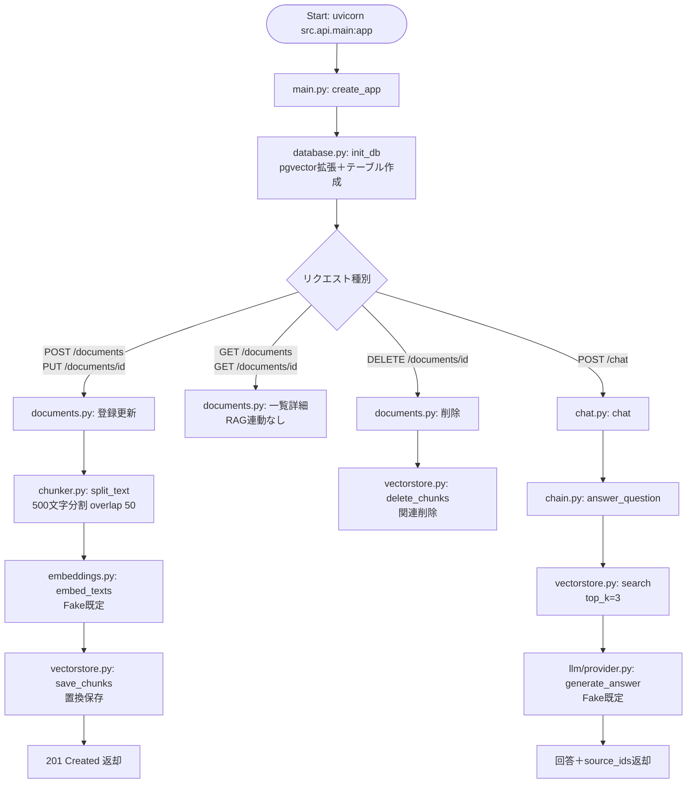

# 1. フローチャート — システム全体の処理フロー (webRagSys)

```mermaid
flowchart TD
    A(["Start: uvicorn src.api.main:app"]) --> B[main.py: create_app]
    B --> C[database.py: init_db<br>pgvector拡張＋テーブル作成]
    C --> D{リクエスト種別}
    D -->|POST /documents<br>PUT /documents/id| E[documents.py: 登録更新]
    E --> F[chunker.py: split_text<br>500文字分割 overlap 50]
    F --> G[embeddings.py: embed_texts<br>Fake既定]
    G --> H[vectorstore.py: save_chunks<br>置換保存]
    H --> I[201 Created 返却]
    D -->|GET /documents<br>GET /documents/id| J[documents.py: 一覧詳細<br>RAG連動なし]
    D -->|DELETE /documents/id| K[documents.py: 削除]
    K --> L[vectorstore.py: delete_chunks<br>関連削除]
    D -->|POST /chat| M[chat.py: chat]
    M --> N[chain.py: answer_question]
    N --> O[vectorstore.py: search<br>top_k=3]
    O --> P[llm/provider.py: generate_answer<br>Fake既定]
    P --> Q[回答＋source_ids返却]
```
