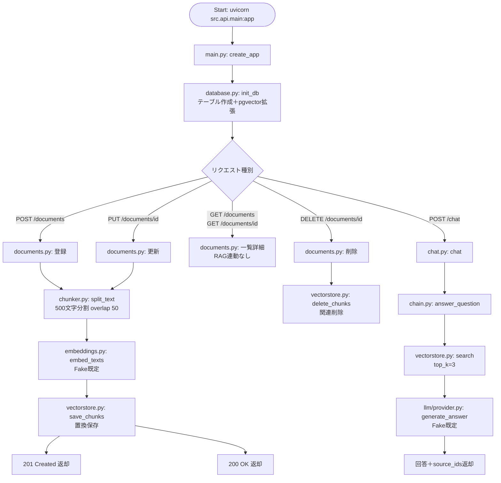

# 1. フローチャート Rev.A — システム全体の処理フロー (webRagSys)

## この図は何を示すか
起動から受付、分岐、RAG化、回答までの全体手順を示します。たとえるなら工場の工程図です。

## なぜ必要か
分岐先でRAG連動の有無が変わるためです。一覧詳細は書庫直読み、登録更新と質問は索引係を経由します。

## 読み方
上から下へ進みます。ひし形が分岐、右側が質問応答の流れです。

## 初心者が混乱しやすい点
- POSTは201 Created、PUTは200 OKで返ります。初版は一括表記のためRev.Aで分離しました。
- SQLite運用時はpgvector拡張を行わずテーブル作成のみです。方言判定で切替えます。
- DELETEは索引削除が先です。本体先行では関連が残ります。

## 実コードとの対応
- `src/api/main.py`：create_appと起動時init_db
- `src/api/routers/documents.py`：CRUD5件、登録更新時にchunks再生成
- `src/rag/chain.py`：answer_question（検索→整形→生成）

