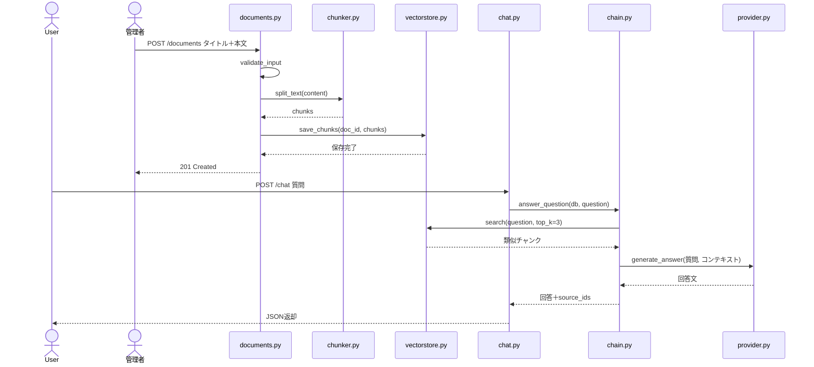

# 2. シーケンス図 Rev.A — 登録と質問応答の通信 (webRagSys)

## この図は何を示すか
登録時と質問時の参加者間の送受信順序を示します。たとえるなら電話の通話記録です。

## なぜ必要か
呼出順序の誤りはRAG不動作の主因のためです。特に登録→分割→保存の順序は固定です。

## 読み方
上から下へ時間順です。実線矢印が依頼、破線矢印が返答です。

## 初心者が混乱しやすい点
- AdminとUserは役割のたとえです。認証機能はありません。同一利用者が両方行います。
- `validate_input`は空欄検査です。違反時は422で本線に入りません。
- 質問前に文書登録が必要です。未登録では類似結果が空になります。

## 実コードとの対応
- `src/api/routers/documents.py`：execute_logic_register（挿入→RAG化）
- `src/rag/chain.py`：answer_question（検索→整形→生成）

