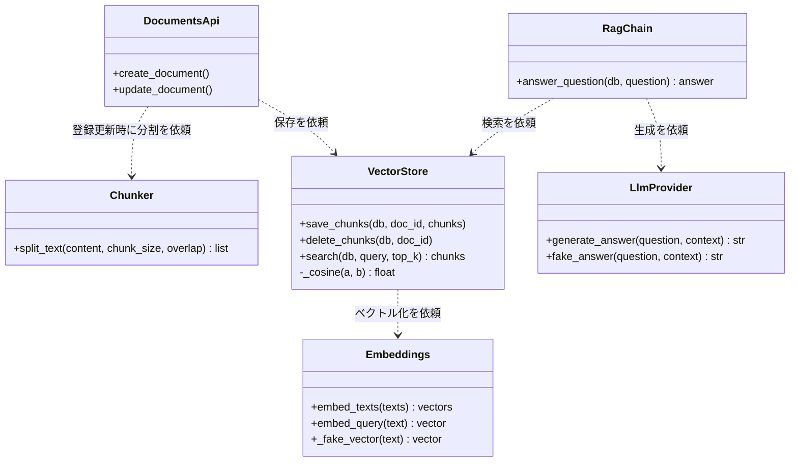

# 3a. クラス図 Rev.A — RAG構成要素（詳細）

## この図は何を示すか
RAG関係部品の機能と依頼方向を示します。たとえるなら職分表です。

## なぜ必要か
依頼方向の誤読は循環参照の温床のためです。本図は一方通行を保証します。

## 読み方
破線矢印の起点が依頼側、終点が作業側です。

## 初心者が混乱しやすい点
- 初版のVectorStoreからChunkerへの依存は誤りでした。実コードでchunkerを呼ぶのはdocuments.pyです。Rev.AでDocumentsApiからの依頼に修正しました。
- `_cosine`と`_fake_vector`の先頭`_`は内部専用の意味です。外部から呼びません。
- EmbeddingsのFakeと本番は切替式です。呼出側の変更は不要です。

## 実コードとの対応
- `src/api/routers/documents.py`：DocumentsApi相当、chunkerとvectorstoreを呼ぶ
- `src/rag/vectorstore.py`：保存検索、embeddingsのみ依頼
- `src/rag/chain.py`：RagChain相当、検索と生成の順序決定

