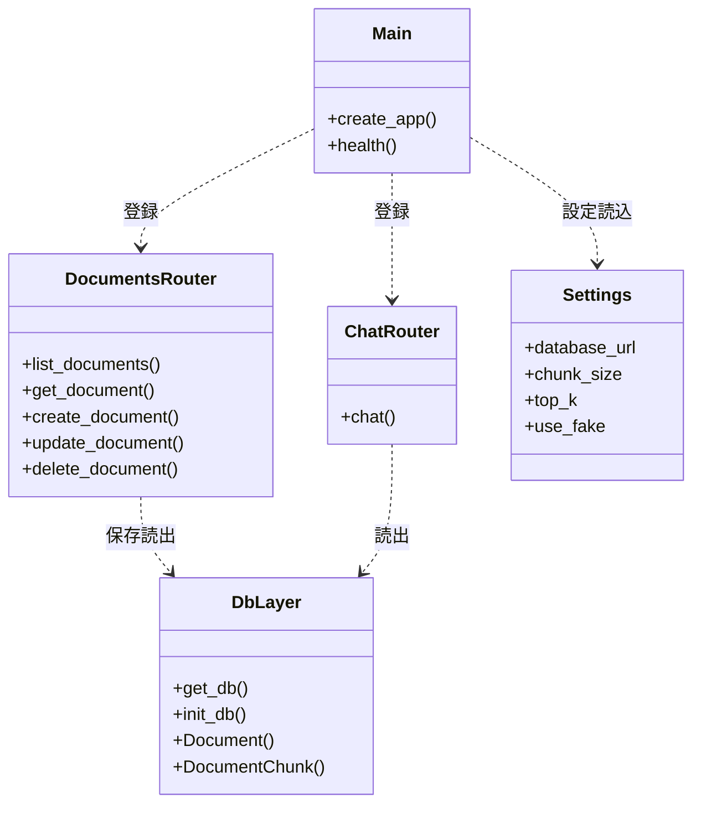

# 3b. クラス図 — モジュール構造

```mermaid
classDiagram
    class Main {
        +create_app()
        +health()
    }
    class DocumentsRouter {
        +list_documents()
        +get_document()
        +create_document()
        +update_document()
        +delete_document()
    }
    class ChatRouter {
        +chat()
    }
    class DbLayer {
        +get_db()
        +init_db()
        +Document()
        +DocumentChunk()
    }
    class Settings {
        +database_url
        +chunk_size
        +top_k
        +use_fake
    }
    Main ..> DocumentsRouter : 登録
    Main ..> ChatRouter : 登録
    DocumentsRouter ..> DbLayer : 保存読出
    ChatRouter ..> DbLayer : 読出
    Main ..> Settings : 設定読込
```
