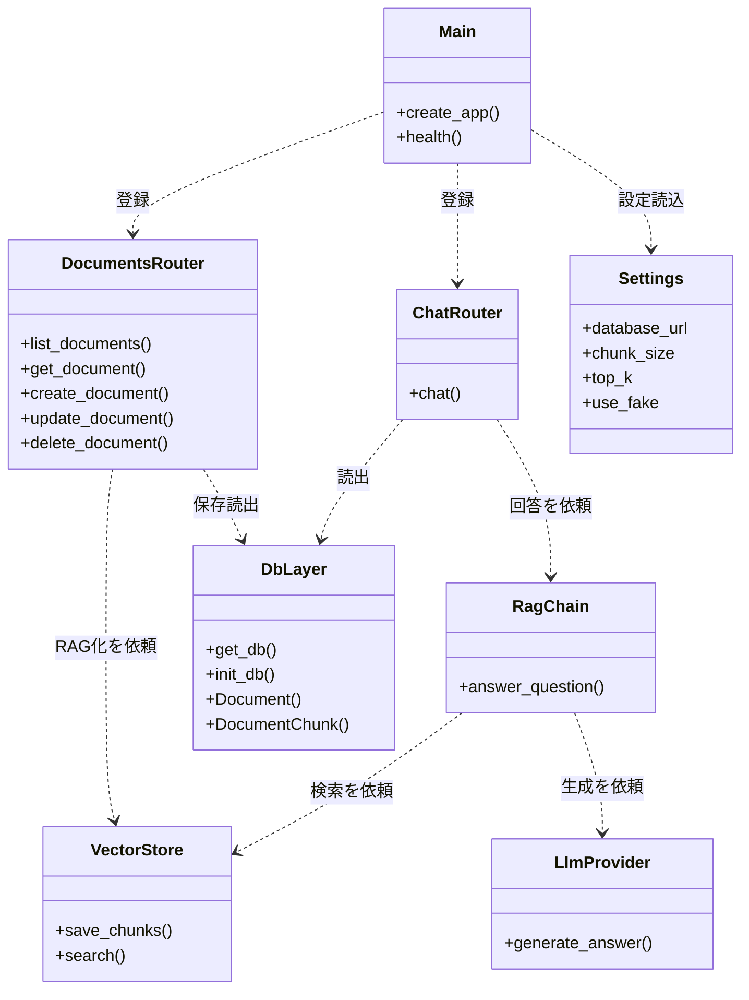

# 3b. クラス図 Rev.A — モジュール構造

## この図は何を示すか
起動点、受付、DB、設定の全体関係を示します。たとえるなら組織図です。

## なぜ必要か
新規参加者が最初に掴むべき配線図のためです。変更時の影響範囲が読めます。

## 読み方
Mainから外側へ依頼が流れます。DB層からAPI層への逆流はありません。

## 初心者が混乱しやすい点
- 初版はChatのRAG経路が欠けていました。Rev.AでChatRouterからRagChainへの依頼を追加しました。
- DbLayerのDocument等は関数ではなく表定義です。行の雛形と読みます。
- Settingsは全層の参照元です。直書き設定は禁止です。

## 実コードとの対応
- `src/api/main.py`：Main相当、ルータ登録と起動時init_db
- `src/api/routers/chat.py`：ChatRouter相当、chainへ委譲
- `config.py`：Settings相当、.env読込

