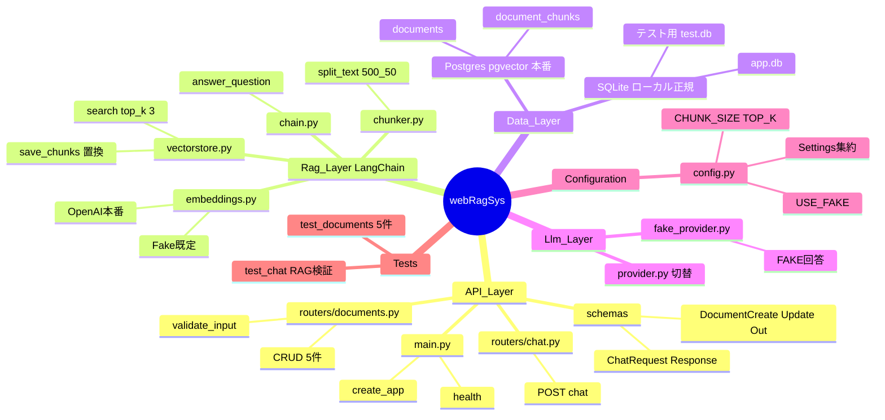

# 4. マインドマップ Rev.A — システム概念の階層整理

## この図は何を示すか
全構成要素の所属階層を示します。たとえるなら目次です。

## なぜ必要か
未知ファイルの所属判定に使うためです。配置先の誤りを防ぎます。

## 読み方
中心から外側へ大分類から小部品へ進みます。

## 初心者が混乱しやすい点
- 初版はSQLiteをテスト用のみと記載していました。Rev.Aでローカル正規の`app.db`を追加しました。
- Postgresは本番用です。Docker対象外のため通常はSQLite側を使用します。
- `500_50`は500文字分割と50文字重なりの意味です。

## 実コードとの対応
- `config.py`：Configuration相当
- `tests/`：Tests相当、conftest.pyでSQLite分離

