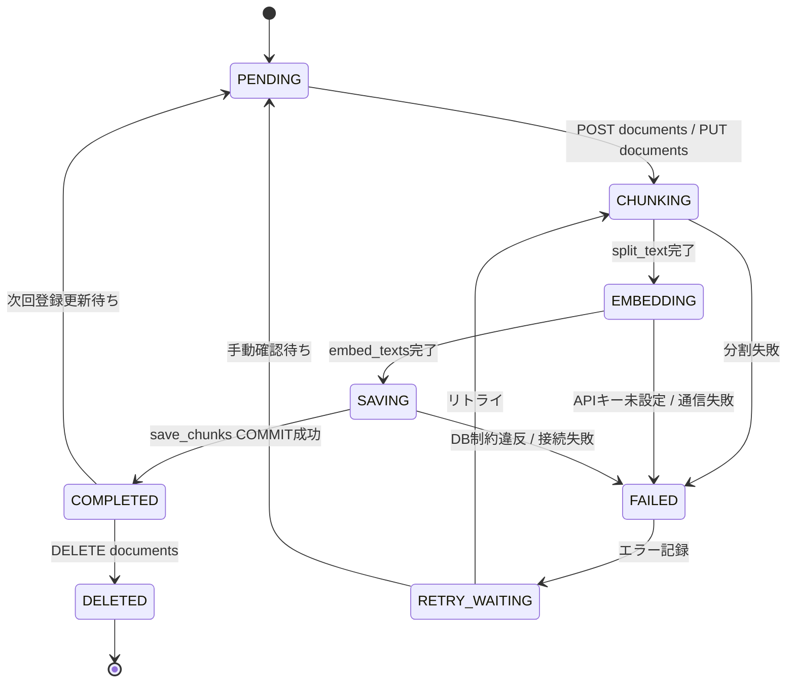

# 5. 状態遷移図 — 文書取込ライフサイクル

```mermaid
stateDiagram-v2
    [*] --> PENDING
    PENDING --> CHUNKING: POST documents / PUT documents
    CHUNKING --> EMBEDDING: split_text完了
    EMBEDDING --> SAVING: embed_texts完了
    SAVING --> COMPLETED: save_chunks COMMIT成功
    COMPLETED --> PENDING: 次回登録更新待ち
    COMPLETED --> DELETED: DELETE documents
    DELETED --> [*]
    CHUNKING --> FAILED: 分割失敗
    EMBEDDING --> FAILED: APIキー未設定 / 通信失敗
    SAVING --> FAILED: DB制約違反 / 接続失敗
    FAILED --> RETRY_WAITING: エラー記録
    RETRY_WAITING --> CHUNKING: リトライ
    RETRY_WAITING --> PENDING: 手動確認待ち
```
