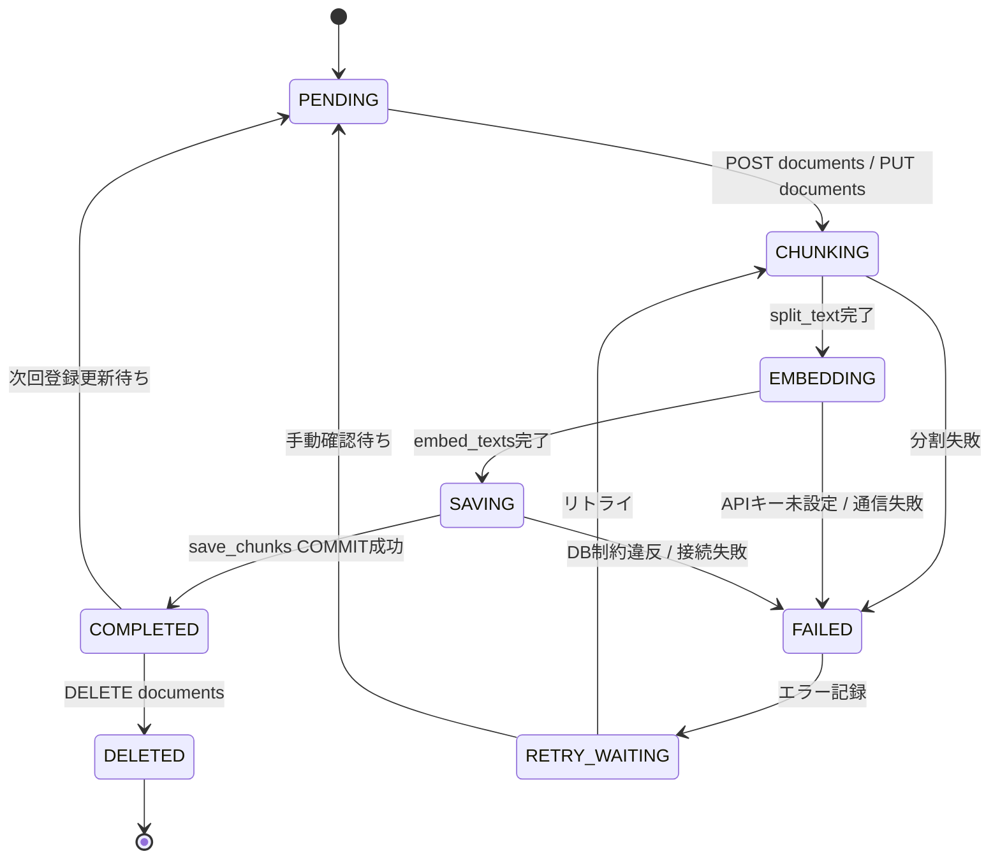

# 5. 状態遷移図 Rev.A — 文書取込ライフサイクル

## この図は何を示すか
文書1件の取込手順の進行状態を示します。たとえるなら宅配の追跡表示です。

## なぜ必要か
失敗箇所の切分けに使うためです。状態名で工程が特定できます。

## 読み方
PENDING開始、COMPLETED成功、FAILED失敗です。矢印の条件が遷移理由です。

## 初心者が混乱しやすい点
- PENDING等はDBの列ではありません。論理手順の名前です。表に状態列は存在しません。
- RETRY_WAITINGからのリトライ機構は未実装です。現状は手動再送で対応します。
- FAILED時はHTTP例外（422や500）で返ります。状態遷移図とCode対応表を併読します。

## 実コードとの対応
- `src/api/routers/documents.py`：PENDING相当の受付と検証
- `src/rag/vectorstore.py`：SAVING相当の置換保存とCOMMIT

