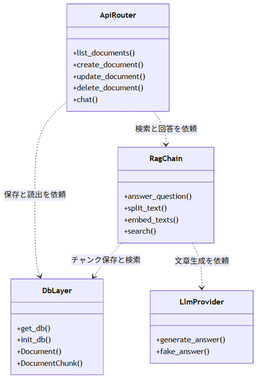
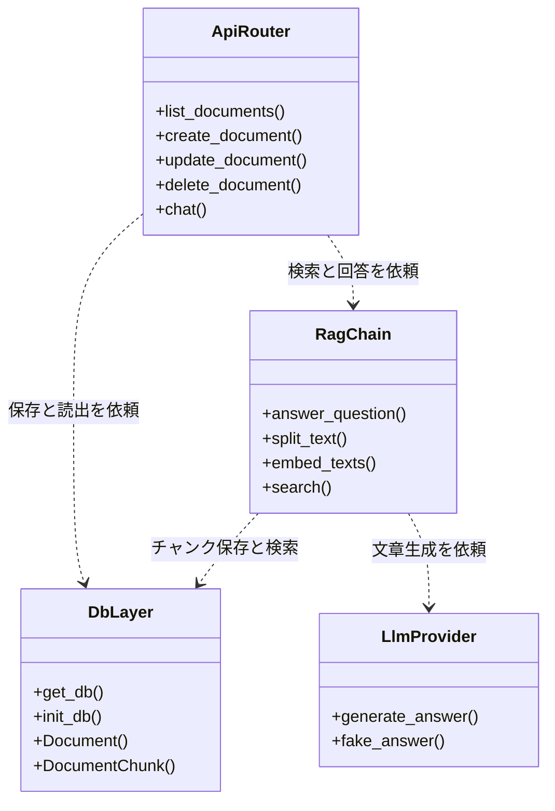
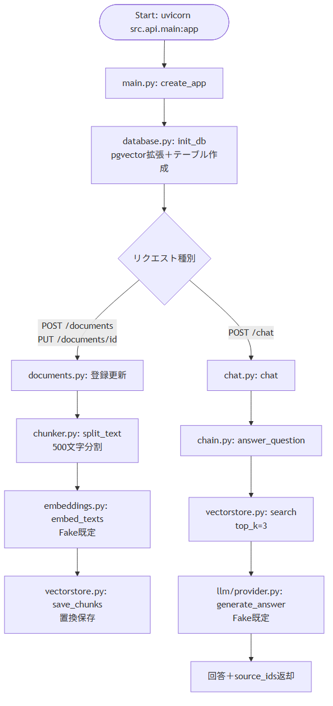
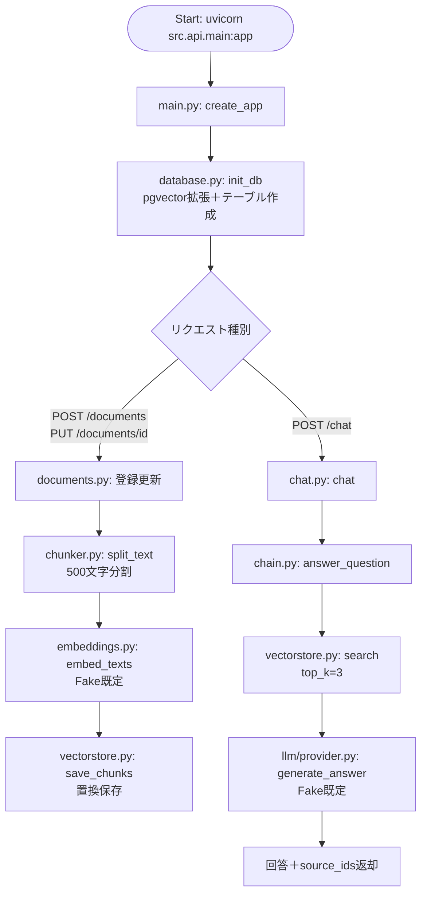
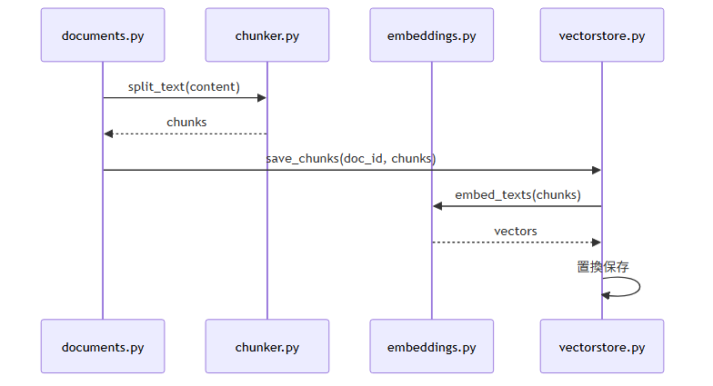
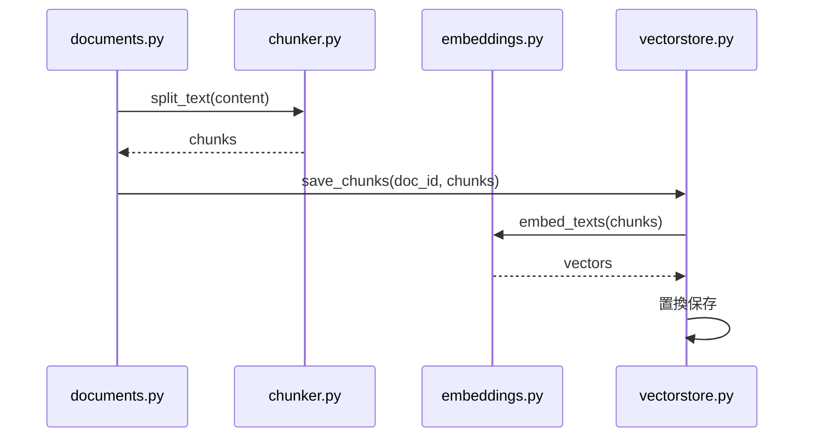
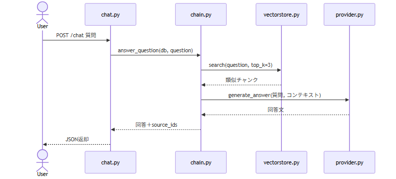
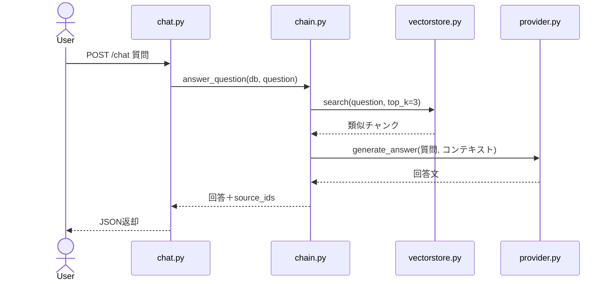

# Beginner Overview — webRagSys 初心者向け解説

このドキュメントは、`webRagSys` を初めて読むPython中級者・RAG初心者のために書かれています。
Pythonの基本構文ではなく、FastAPIとLangChainによるRAGの仕組みに焦点を当てます。

---

## 1. プロジェクト全体構造と役割

### 1.1 このプロジェクトは何をするのか

**webRagSys** は、社内文書を登録し、その文書を根拠にAIが回答するWeb APIシステムです。

- 文書CRUD：タイトルと本文を登録・一覧・詳細・更新・削除する
- RAG化：文書を分割し、Embedding化してVector Databaseへ保存する
- AIチャット：質問をEmbedding化し、類似文書を検索してLLMが回答する
- 既定は偽実装：EmbeddingもLLMもFakeを使い、課金なしで学習できる

たとえるなら、文書管理は書庫係、RAGは索引係、LLMは回答係です。

### 1.2 フォルダ構成

```text
webRagSys/
├── AGENTS.md              ← 作業規約（必読）
├── README.md              ← 使い方入門書
├── config.py              ← 設定集約（DB、RAG、LLM切替）
├── requirements.txt       ← 依存一覧
├── Dockerfile             ← APIイメージ定義
├── docker-compose.yml     ← API＋PostgreSQL＋pgvector構成
├── .env.example           ← 公開用設定見本（実キーは書かない）
├── src/api/main.py        ← 起動点（create_app、ルータ登録）
├── src/api/routers/       ← documents.py（CRUD）、chat.py（質問応答）
├── src/schemas/           ← Pydantic入出力定義
├── src/db/                ← database.py（接続）、models.py（2テーブル）
├── src/rag/               ← chunker、embeddings、vectorstore、chain
├── src/llm/               ← provider.py（切替）、fake_provider.py（偽回答）
├── tests/                 ← test_documents.py、test_chat.py、conftest.py
├── docs/                  ← 本書、handover.md
└── diagrams/              ← 図の元データ（Mermaid形式）
```

### 1.3 各フォルダの担当

| フォルダ | 役割 | たとえると… |
|---------|------|------------|
| `src/api/` | HTTP受付と振分 | 受付窓口 |
| `src/schemas/` | 入出力の検品 | 受付票の雛形 |
| `src/db/` | 保存と読出 | 書庫 |
| `src/rag/` | 分割・検索・回答組立 | 索引係と下書き係 |
| `src/llm/` | 文章生成 | 回答係 |
| `tests/` | 品質保証 | 検品係 |
| `docs/` | 設計書・説明書 | マニュアル |

### 1.4 主要ファイルの役割

| ファイル | 担当 | 重要なポイント |
|---------|------|--------------|
| **config.py** | 設定集約 | `USE_FAKE=true`既定、`chunk_size=500`、`top_k=3` |
| **src/api/main.py** | app生成 | `create_app()`でルータ登録する |
| **src/api/routers/documents.py** | CRUD | 登録・更新時にchunks再生成する（57、104行目） |
| **src/db/models.py** | 2テーブル | `documents`と`document_chunks`、Postgres時はVector型 |
| **src/rag/chunker.py** | 分割 | LangChain優先、なければ単純分割に退避する |
| **src/rag/embeddings.py** | ベクトル化 | Fake既定、本番のみOpenAI通信する |
| **src/rag/vectorstore.py** | 保存検索 | 置換保存、コサイン類似検索する |
| **src/rag/chain.py** | 回答手順 | 検索→整形→生成の順序だけを決める |
| **src/llm/provider.py** | 切替 | Fakeか本番かを1か所で決める |

---

## 2. モジュール間の依存関係

### 2.1 依存関係の全体像



<details>
<summary>図の元データ（Mermaid）</summary>


</details>

### 2.2 依存の方向性

webRagSysでは **「API → RAG → DB／LLM」** の一方通行で依存します。

```text
src/api/main.py（create_app）
  ├── src/api/routers/documents.py（CRUDを依頼）
  │     ├── src/db/models.py（保存）
  │     └── src/rag/chunker.py＋vectorstore.py（RAG化）
  ├── src/api/routers/chat.py（質問応答を依頼）
  │     └── src/rag/chain.py（answer_question）
  │           ├── src/rag/vectorstore.py（類似検索）
  │           └── src/llm/provider.py（文章生成）
  └── src/db/database.py（DB初期化）
```

**「一方通行」が重要な理由**：`src/db/` が `src/api/` を参照することはありません。これによってDB実装をPostgreSQLから他DBへ変えてもAPI層に影響が出ません。

### 2.3 `import` のしくみ — なぜ遅延importするのか

```python
# src/db/database.py：init_db内で遅延importする
from src.db import models  # テーブル登録のため
```

**読み方のコツ**：通常の`import`はファイル先頭に書きますが、循環参照を避けたい場合だけ関数内で書きます。ここでは`database.py`と`models.py`が互いを参照するため、実行直前に読み込む方式にしています。

### 2.4 呼び出しの流れ（具体例）

```python
# documents.py:57（登録時にRAG化する）
vectorstore.save_chunks(db, doc.id, chunker.split_text(doc.content))

# chain.py（質問時の流れ）
hits = vectorstore.search(db, question)  # 類似検索
answer = generate_answer(question, context)  # LLM生成
```

---

## 3. データの流れ（3つのフェーズ）

webRagSysのデータは **「登録する → RAG化する → 質問に答える」** の3段階で流れます。

### 3.1 全体フロー



<details>
<summary>図の元データ（Mermaid）</summary>


</details>

### 3.2 フェーズ1：文書登録（外部 → DB）

CRUDの5APIが`documents`テーブルを操作します。

| API | 処理 | RAG連動 |
|-----|------|---------|
| POST /documents | 挿入 | chunks生成する |
| PUT /documents/id | 更新 | chunks置換する |
| DELETE /documents/id | 削除 | chunks削除する |
| GET /documents | 一覧 | 連動なし |
| GET /documents/id | 詳細 | 連動なし |

**置換保存の理由**（`vectorstore.py:55`）：更新時に古いベクトルが残ると誤検索の原因になるため、一度全削除してから挿入し直します。

### 3.3 フェーズ2：RAG化（文書 → ベクトル）



<details>
<summary>図の元データ（Mermaid）</summary>


</details>

RAG初心者向けの要点：

- **チャンク**：長文を500文字単位に切った断片。検索精度とLLM入力長の調整役です。
- **Embedding**：文章を数値ベクトル化する処理。意味の近さが数値の近さになります。
- **SQL検索との違い**：SQLは完全一致探し、ベクトル検索は意味の近さ探しです。「休暇は何日」と「年次休暇は10日」は文字は違いますが意味が近いため検索できます。

### 3.4 フェーズ3：質問応答（質問 → 回答）



<details>
<summary>図の元データ（Mermaid）</summary>


</details>

**データベースのテーブル構成**：

```text
documents（文書本体）
  │
  └── document_chunks（RAG用断片）
        └── document_id で紐づく
        └── chunk_index、content、embeddingを保持
```

---

## 4. 中級者がつまずきやすいポイント

### 4.1 FastAPI編

#### FastAPIの `Depends(get_db)`（documents.py:62）

```python
def list_documents(db: Session = Depends(get_db)) -> list[Document]:
```

**何をしているのか**：「このAPIを呼ぶ前に`get_db()`を実行し、その結果を`db`引数に入れてほしい」という宣言です。

**なぜ必要なのか**：DB接続の開閉を各APIに書くと重複します。`Depends`に任せると、成功時はセッション提供、終了時は自動closeになります。テスト時は`dependency_overrides`で偽DBに差し替えられます（`tests/conftest.py`）。

**間違えやすいポイント**：`Depends(get_db())`のように括弧付きで書くと実行結果が固定され、リクエストごとに新規接続されません。括弧なしが正解です。

---

#### Pydanticの `from_attributes`（schemas/document.py）

```python
class DocumentOut(BaseModel):
    model_config = {"from_attributes": True}
```

**何をしているのか**：SQLAlchemyの行オブジェクトからPydantic応答への変換を許可します。

**なぜ必要なのか**：`Document`行を`DocumentOut`に変換する際、辞書でなく属性アクセス（`doc.title`）で読む必要があるためです。これがないと一覧・詳細APIの返却時に変換エラーになります。

---

#### `on_event("startup")` の役割（main.py）

起動時に`init_db()`を実行し、テーブルとpgvector拡張を作成します。テスト時はDB未起動でもimportできるよう、失敗時は警告記録のみにしています。

---

### 4.2 LangChain編

#### TextSplitter — なぜ分割するのか（chunker.py）

```python
splitter = RecursiveCharacterTextSplitter(chunk_size=500, chunk_overlap=50)
```

**何をしているのか**：長文を500文字単位に切り、50文字だけ重ねます。

**なぜ必要なのか**：区切れ目で文意が切断されるのを防ぐためです。重なり部分が前後関係を保持します。本実装ではLangChainがあればそれを使い、なければ単純分割に退避します。

**間違えやすいポイント**：`chunk_size`を大きくすれば精度が上がるわけではありません。大きすぎるとLLM入力が関連の薄い文章で埋まります。`config.py`の500と3件は学習用の出発点です。

---

#### Embeddings — Fakeと本番の違い（embeddings.py:54）

```python
if settings.use_fake or not settings.openai_api_key:
    return [_fake_vector(t) for t in texts]
```

**何をしているのか**：既定は課金なしFake、本番のみOpenAI通信です。

**なぜ必要なのか**：学習中にAPI課金が発生しないようにするためです。Fakeは文字コード合計から決定的ベクトルを作るため、再実行しても同じ結果になります。

**間違えやすいポイント**：Fakeは意味を理解していません。文字の並びが近い文書が類似と判定されます。本番Embeddingに替えると意味検索になりますが、配線自体は同じです。

---

#### RetrieverとChain — なぜ薄い層なのか（chain.py）

```python
hits = vectorstore.search(db, question)
answer = generate_answer(question, context)
```

**何をしているのか**：検索と生成の順序だけを決めています。

**なぜ必要なのか**：LangChainの本格Chain（LCEL等）に置き換える際、呼出側（`chat.py`）を変更せずに済むためです。現段階では見通し優先の最小実装です。

---

### 4.3 DB／RAG編

#### pgvector拡張 — なぜ必要なのか（database.py）

PostgreSQLでベクトル列を使うには `CREATE EXTENSION IF NOT EXISTS vector` が必要です。SQLite退避時はJSON列で代替します（`models.py`）。件数が少ない学習段階ではPython側のコサイン計算で十分です。

---

#### コサイン類似度 — 何を計算しているのか（vectorstore.py:28）

```python
dot / (na * nb)
```

**何をしているのか**：2ベクトルの向きの近さを0〜1で数値化しています。1に近いほど類似です。

**なぜ必要なのか**：ベクトル検索の核心だからです。質問ベクトルと全チャンクの類似度を計算し、上位3件（`top_k`）だけをLLMへ渡します。

---

#### `.env` と `.env.example` の違い

| ファイル | 役割 | Git管理 |
|---------|------|---------|
| `.env` | 実設定値（APIキー含む） | 除外する |
| `.env.example` | 公開用見本（空欄） | 含める |

**間違えやすいポイント**：`.env`をcommitするとAPIキーが公開されます。`config.py`は`.env`を読みますが、キーなしでもFake動作するため学習に支障はありません。

---

## 付録：学習の順番

```text
STEP 1: README.md                 → 目的と使い方を理解
STEP 2: config.py                 → 設定値を把握
STEP 3: src/db/models.py          → 2テーブルを把握
STEP 4: src/api/routers/documents.py → CRUDを読む
STEP 5: src/rag/chunker.py        → 分割を読む
STEP 6: src/rag/embeddings.py     → Fakeと本番の切替を読む
STEP 7: src/rag/vectorstore.py    → 保存と検索を読む
STEP 8: src/llm/provider.py       → 切替を読む
STEP 9: src/rag/chain.py          → 回答手順を読む
STEP 10: src/api/routers/chat.py  → 質問応答を読む
STEP 11: tests/                   → 検証内容を読む
STEP 12: diagrams/                → 図で全体を復習
```

---

> このドキュメントは `README.md`、`AGENTS.md`、`config.py` および `src/`、`tests/` の実コードを参照して作成されています。
