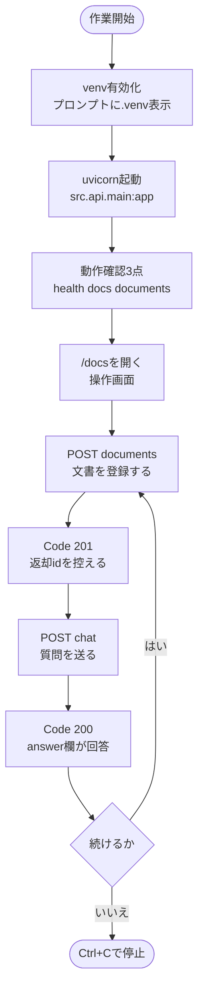

# webRagSys 取扱説明書（操作手順書）

この説明書は、`webRagSys` を操作する人のための手順書です。Python中級者・RAG初心者を対象とします。
コードの仕組みは `beginner_overview_RevA.md`、図の詳細は `diagrams/*_RevA.md` を参照します。

---

## 1. 作業の全体像


<details>
<summary>図の元データ（Mermaid）</summary>


</details>

作業順序は「有効化 → 起動 → 確認 → 登録 → 質問 → 停止」です。登録を飛ばすと回答の根拠が空になります。

---

## 2. 起動手順

### 2.1 仮想環境の有効化

```powershell
cd <プロジェクト直下>
.\.venv\Scripts\Activate.ps1
```

プロンプトの先頭に`(.venv)`と表示されることを確認します。表示がない場合は有効化されていません。
cmd利用時は`.venv\Scripts\activate.bat`を使います。`.\.venv\Scripts\Activate.ps1`はPowerShell専用です。

### 2.2 サーバ起動

```powershell
uvicorn src.api.main:app --reload
```

エラー表示なしで待受状態になれば成功です。停止は`Ctrl+C`です。

### 2.3 動作確認3点

ブラウザで以下を開きます。

| 確認先 | 正常表示 | 意味 |
|--------|----------|------|
| http://127.0.0.1:8000/health | `{"status":"ok"}` | サーバ生存確定です |
| http://127.0.0.1:8000/docs | 操作画面 | 以降の操作はここで行います |
| http://127.0.0.1:8000/documents | `[]` | 初期は空で正常です |

**注意点**：`http://127.0.0.1:8000/` は未定義のため404が正常です。上記3件で確認します。

---

## 3. /docs画面の読み方

| 分類 | 内容 |
|------|------|
| default | GET /health。生存確認です |
| documents | 文書の登録・一覧・詳細・更新・削除です |
| chat | POST /chat。質問応答です |
| schemas | 入出力の雛形です。参照用であり実行対象ではありません |

各項目は展開して使います。操作の基本は「展開 → Try it out → 入力 → Execute → Responses確認」です。

---

## 4. 文書登録

1. documentsのPOST /documentsを展開し、Try it outを押します。
2. Request bodyに以下を入力します。

```json
{"title": "休暇規定", "content": "年次休暇は10日付与する。"}
```

3. Executeを押します。
4. ResponsesのCodeが201であることを確認します。
5. bodyの`id`を控えます。後の詳細・更新・削除と質問の根拠確認に使います。

titleとcontentのどちらかが空の場合はCode 422になります。両方記載して再送します。

---

## 5. 一覧・詳細・更新・削除

| 操作 | 確認点 |
|------|--------|
| GET /documents | Code 200で一覧表示です |
| GET /documents/{id} | 控えたidを入力します。存在しない番号は404です。数字以外は422です |
| PUT /documents/{id} | Code 200で更新成功です。検索用情報も置換されます |
| DELETE /documents/{id} | Code 204で削除成功です。bodyなしが正常です |

---

## 6. 会話（質問応答）

### 6.1 前提
先に4章で文書登録を済ませます。未登録では回答の根拠が空になります。

### 6.2 手順
1. chatのPOST /chatを展開し、Try it outを押します。
2. Request bodyに以下を入力します。

```json
{"question": "休暇申請の手順は？"}
```

3. Executeを押します。
4. ResponsesのCodeが200であることを確認します。
5. bodyの`answer`欄が回答です。`source_ids`が根拠文書の番号です。

### 6.3 結果の読み方
- `source_ids`に番号あり：会話成立です。番号の文書が根拠です。
- `source_ids`が空：回答はあるが根拠なしです。文書を登録して再送します。
- Code 422：質問文が空です。1文字以上記入して再送します。
- Code 500：内部障害です。サーバを再起動して再送します。

---

## 7. よくある失敗と対応

| 症状 | 原因 | 対応 |
|------|------|------|
| `uvicorn`が認識されない | venv未有効化 | Activate後に再実行します |
| host名dbの解決失敗 | .envがDocker用指定 | `DATABASE_URL=sqlite:///./app.db`にします |
| `/`で404 | 未定義が正常 | /health等3点で確認します |
| 一覧が`[]` | 登録ゼロ | 正常です。4章で登録します |
| 根拠空 | 未登録で質問 | 登録後に再送します |
| Remove-Item不可 | cmd利用 | `rmdir /s /q .venv`を使うかPowerShellに切替えます |

---

## 8. 関連文書
- `README.md`：導入と起動の概要です
- `docs/beginner_overview_RevA.md`：仕組みの解説です
- `diagrams/*_RevA.md`：図の読み方と実コード対応です
- `docs/handover.md`：進捗管理です

---

> 本書は実コードと実操作を確認して作成されています。APIキー等の機密情報は記載しません。
